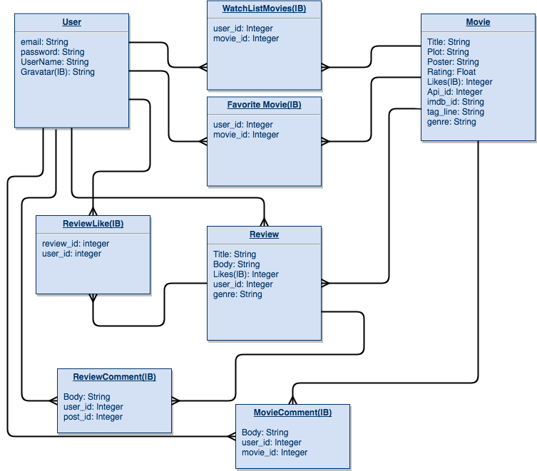
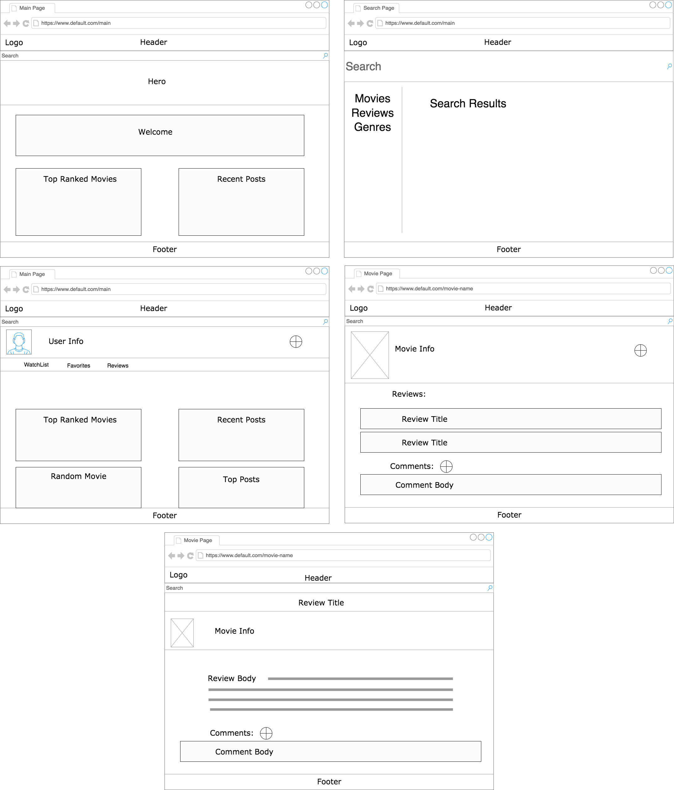

# WDI_Project_4
Good Bad Movie community Site
---
---
### Project: Caged Movies
### Heroku Link: [Heroku App](https://caged-movies.herokuapp.com/)
### Trello Board: [WDI Project 4](https://trello.com/b/af738Bnd/project-caged-movies)
### Technologies Used:

Ruby, Javascript, HTML, Css. Built with React on Rails stack
---
#### Goal (v1): 

Create a community app for the terrible movies that people love to watch. For example a lot of Nicolas Cage Movies. The app will connect to the movie db api and utilize its database to help users create reviews on the movies. The user will also be able to explore other bad movies they might be interested in. Reach goals are to provide a watch list and favorite movie list for user. Allow users to comment on movies and Reviews.

---
### ERD:

---
### Wireframes

